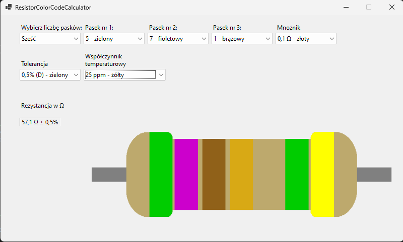

# Resistor Color Code Calculator

Prosta aplikacja Windows Forms do obliczania rezystancji na podstawie kodów paskowych rezystorów, stworzona w .NET 8.

## Opis
Aplikacja pozwala użytkownikom wybrać liczbę pasków (4, 5 lub 6) i kolory, aby obliczyć rezystancję, tolerancję oraz współczynnik temperaturowy (dla 6 pasków). Dynamicznie generuje obraz rezystora.

## Funkcjonalności
- Obsługa rezystorów z 4, 5 i 6 paskami.
- Obliczanie rezystancji i tolerancji.
- Wizualizacja rezystora z wybranymi kolorami.

## Jak uruchomić?

### Wersja gotowa (Self-Contained)
1. Pobierz `ResistorColorCodeCalculator-v1.0.0-selfcontained.zip` z [Releases](https://github.com/twoje-nazwa/ResistorColorCodeCalculator/releases).
2. Rozpakuj archiwum.
3. Upewnij się, że folder `Images` jest w tym samym katalogu co `.exe`.
4. Uruchom `ResistorColorCodeCalculator.exe`.

### Wersja zależna od .NET 8 (Framework-Dependent)
1. Pobierz `ResistorColorCodeCalculator-v1.0.0-framework.zip` z [Releases](https://github.com/twoje-nazwa/ResistorColorCodeCalculator/releases).
2. Rozpakuj archiwum.
3. Zainstaluj .NET 8 Desktop Runtime z [tutaj](https://dotnet.microsoft.com/en-us/download/dotnet/8.0).
4. Uruchom `ResistorColorCodeCalculator.exe`.

### Dla deweloperów
1. Sklonuj repozytorium: `git clone https://github.com/twoje-nazwa/ResistorColorCodeCalculator.git`
2. Otwórz w Visual Studio 2022 i skompiluj.

## Technologie
- .NET 8
- Windows Forms
- C#

## Licencja
MIT License - zobacz [LICENSE](LICENSE).

## Autor
Charn3ll